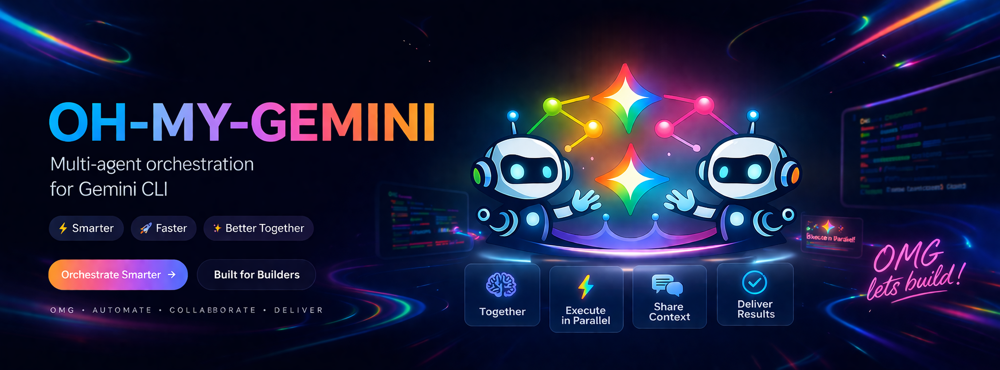
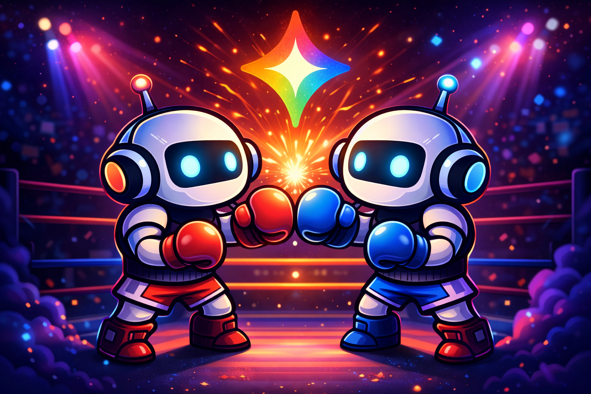
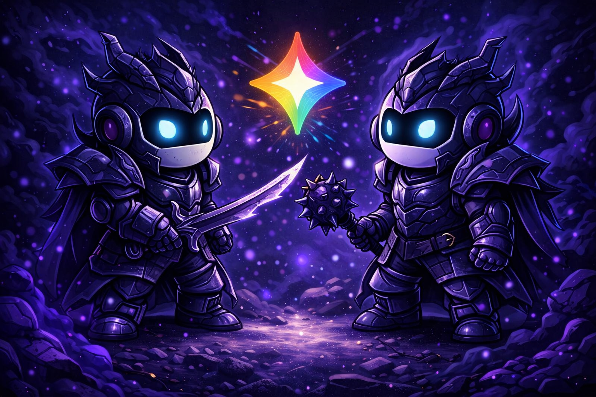

<p align="center">
  
</p>

# oh-my-gemini

[](https://www.npmjs.com/package/oh-my-gemini)
[](https://github.com/jjongguet/oh-my-gemini/stargazers)
[](https://opensource.org/licenses/MIT)
[](https://github.com/sponsors/jjongguet)

> **Sister projects:** [oh-my-claudecode (OMC)](https://github.com/Yeachan-Heo/oh-my-claudecode) | [oh-my-codex (OMX)](https://github.com/Yeachan-Heo/oh-my-codex)

**Multi-agent orchestration for Gemini CLI with OMG branding.**

> **Transition complete (2026-04-13):** this repo uses `oh-my-gemini` / `omg` as the canonical user-facing surface. The legacy `omg` / `oh-my-gemini` bin entries have been removed. See [`docs/analysis/2026-04-13-oh-my-gemini-phase-1-doc-and-quality-review.md`](docs/analysis/2026-04-13-oh-my-gemini-phase-1-doc-and-quality-review.md) for the migration history.

[Quick Start](#quick-start) | [Team Mode](#team-mode) | [Commands](#commands) | [Docs](docs/)

---

## Quick Start

```bash
npm install -g oh-my-gemini
omg setup --scope project
gemini
```

After setup, restart Gemini CLI for `/omg:*` commands to appear (`/omg:*` remains compatible during migration).

The packaged extension now ships a Gemini-native `hooks/hooks.json` bridge and exposes `omg_cli_tools` as the canonical MCP server id.

```bash
omg doctor                                    # check prerequisites
omg team run --task "..." --workers 2         # parallel work
omg hud --watch                               # live status
```

Primary CLI launches (`omg` / `omg launch`) perform a throttled TTY-only update check (12h cache) and can prompt to run `npm install -g oh-my-gemini@latest`.  
Disable the prompt with `OMG_AUTO_UPDATE=0` (compatibility alias: `OMG_AUTO_UPDATE=0`).

---

## Team Mode

tmux-first multi-worker orchestration with persistent state and lifecycle controls.

```bash
omg team run --task "review src/ for reliability gaps" --workers 4
omg team status --team oh-my-gemini --json
omg team resume --team oh-my-gemini
omg team shutdown --team oh-my-gemini --force
```

Default backend: `tmux` | Optional: `subagents` for role-tagged runs

<p align="center">
  
  <br/>
  <em>Two workers enter, clean code leaves — parallel agents that never pull punches.</em>
</p>

---

## Commands

### CLI

| Command | Description |
|---------|-------------|
| `omg` | Launch Gemini CLI with the oh-my-gemini extension |
| `omg update` | Update the globally installed package immediately |
| `omg team run` | Start orchestrated team run |
| `omg team status/resume/shutdown/cancel` | Team lifecycle |
| `omg doctor` | Diagnose prerequisites |
| `omg verify` | Run validation suites |
| `omg hud` | Live team status overlay |
| `omg skill` | List/print reusable skill prompts |

### Slash Commands (inside Gemini CLI)

| Command | Description |
|---------|-------------|
| `/omg:autopilot` | End-to-end autonomous execution |
| `/omg:plan` | Phased execution plan with gates |
| `/omg:execute` | Immediate task implementation |
| `/omg:review` | Structured code review |
| `/omg:verify` | Acceptance validation |
| `/omg:debug` | Root cause investigation |
| `/omg:status` | Progress summary |
| `/omg:cancel` | Graceful stop |
| `/omg:handoff` | Context transfer document |

Full command reference: [`docs/omg/commands.md`](docs/omg/commands.md)

<p align="center">
  
  <br/>
  <em>Every command, a sworn knight — your codebase defended on all fronts.</em>
</p>

---

## Compatibility Note

User-facing command and documentation surfaces use `omg` / `oh-my-gemini`. The legacy `omg` / `oh-my-gemini` bin entries have been removed from the package.

Some internal identifiers intentionally remain unchanged for now:

- legacy hidden state and artifact paths (`.omg/`)
- legacy `OMG_*` compatibility aliases for selected environment variables
- legacy internal interop identifiers
- legacy internal type/class names
- the temporary `omp_cli_tools` MCP server alias (`omg_cli_tools` is now the canonical id used by setup and extension manifests)

Those internal names are deferred to a later migration to avoid breaking state, protocol, and compatibility contracts.

---

## Requirements

- **Node.js 20+**
- **[Gemini CLI](https://github.com/google-gemini/gemini-cli)**
- **[tmux](https://github.com/tmux/tmux)** (`brew install tmux` / `apt install tmux`)

---

## Default Model

| Model | Free (OAuth) | Free (API Key) |
|-------|--------------|----------------|
| `gemini-3.1-flash-lite-preview` (default) | Yes | Yes |
| `gemini-3.1-pro-preview` (`--pro`) | Yes | Yes |

Default model on `omg` launch is `gemini-3.1-flash-lite-preview`. Use `omg --pro` for `gemini-3.1-pro-preview` (`omg --pro` also works).

All defaults work without a paid Gemini CLI coding plan — just log in via OAuth (Google Account) or use an API key. Override with `OMG_MODEL_HIGH`, `OMG_MODEL_MEDIUM`, `OMG_MODEL_LOW` env vars. Gemini 3.1, 3, and 2.5 models are all available via `-m` flag.

### Emergency Model Override

If a default model becomes unavailable, override immediately without code changes:

```bash
export OMG_MODEL_HIGH=<working-model>
export OMG_MODEL_MEDIUM=<working-model>
export OMG_MODEL_LOW=<working-model>
```

---

## License

MIT

---

<div align="center">

**[oh-my-claudecode](https://github.com/Yeachan-Heo/oh-my-claudecode) | [oh-my-codex](https://github.com/Yeachan-Heo/oh-my-codex)**

</div>

[](https://www.star-history.com/#jjongguet/oh-my-gemini&type=date&legend=top-left)

[](https://github.com/sponsors/jjongguet)
